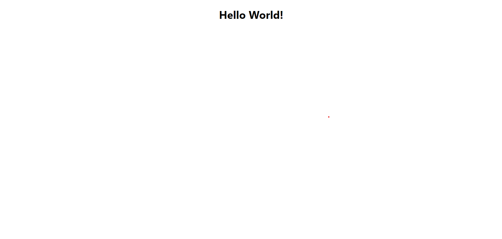

# Making Components in ReactJS

Author: Thuner2007

In this tutorial, we will walk you through the steps to create a React Component and using it.

## Prerequisites

Before we begin, make sure you have following things ready on your machine:

- A react project in JavaScript.

## Step 1: Create components folder

To create a new React component, we will create the components folder, where you can store your components.

Create a "components" folder in the "src" directory. It should look like this:
<br>


## Step 2: Create component file

Once Created the "components" directory, you can create the component file.

To do this make a right click on the "components" folder -> "New file".
Name the file "MyComponent.jsx".

replace `MyComponent` with your components name.

## Step 3: Initialize and export component

Next, we have to initialize and export the component.

To initialize and export the component, you can use the following code:

```jsx
import React from 'react';

const MyComponent = () => {
  // Component logic goes here
  return (
    <div>
      {/* Component JSX goes here */}
      <h1>Hello World!</h1>
    </div>
  );
};

export default MyComponent;
```

Make sure to replace `MyComponent` with the name of your component.

Tip: You can use the `rafce` snippet from the ES7/React-Snippet VSCode extension to quickly generate this code.

## Step 4: Use your component

Now you can use your component like this, for example in the App.js file:

```jsx
import './App.css';
import MyComponent from './components/MyComponent';

function App() {
  return (
    <div className="App">
      <MyComponent />
    </div>
  );
}

export default App;
```

After this, you should see your component:
<br>


## Conclusion

In this tutorial, we learned how to create a new React component. We also learned how to use it in another script.
